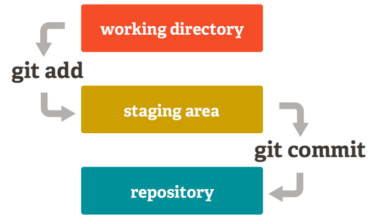
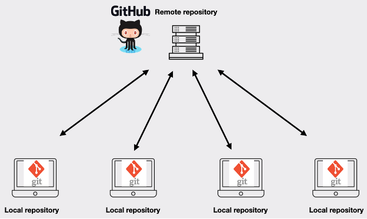

# Git Data Curation Primer
Authors: Vicky Rampin

Affiliate Contributors: Seth Erikson, Rémi Rampin, Jodecy Guerra\*,
Maria Lee\*, Rachel Priesman Marquez\*

DCN Mentor: Shawna Taylor

\**This project was partially funded by Federal funds from the National
Library of Medicine (NLM), National Institutes of Health (NIH), under
cooperative agreement number UG4LM01234 with the University of
Massachusetts Chan Medical School, Lamar Soutter Library. The content is
solely the responsibility of the authors and does not necessarily
represent the official views of the National Institutes of Health.*

# Table of Contents
[Overview](#overview)

[Description of format](#description-of-format)

>[Key terms](#key-terms)
>
>[Background](#background)
>
>[Typical purposes and functions](#typical-purposes-and-functions)

[Curating Git repositories](#curating-git-repositories)
>
>[Resources for reviewing Git repositories](#resources-for-reviewing-git-repositories)
>
>[Key clarifications needed from depositor](#key-clarifications-needed-from-depositor)
>
> [Ethical considerations](#ethical-considerations)
>
> [Folders & files specific to software projects](#folders-files-specific-to-software-projects)
>
>> [.git folder](#git-folder)
>>
>> [Git ignore](#git-ignore)
>>
>> [Tool configuration files](#tool-configuration-files)
>>
>>[Wiki](#wiki)
>>
>> [Changelog](#changelog)
>>
>> [License file](#license-file)
>>
>> [Code owners file](#code-owners-file)
>>
>> [Contributing file](#contributing-file)
>>
>> [Software citation files](#software-citation-files)
>>
>> [Code of Conduct file](#code-of-conduct-file)
>>
>> [Issue / merge request templates](#issue-merge-request-templates)
>>
[CURATE(D) checklist](#curated-checklist)
>
> [Check](#check)
>
> [Understand](#understand)
>
> [Request](#request)
>
> [Augment](#augment)
>
> [Transform](#transform)
>
> [Evaluate](#evaluate)
>
> [Document](#document)

[Preservation Activities](#preservation-activities)

[Resources for learning more](#resources-for-learning-more)

[Bibliography](#bibliography)

# Overview

This primer serves as a guide for curators who receive Git repositories
to curate. Within this primer is not only an overview of Git, its format
and functions, but recommendations on which parts to save, how to test
and verify repositories, and resources for learning more.

|    Topic  | Description  |
| :------------- | :------------- |
|File Extensions| There are no file extensions specifically for Git data; however, the Git data is stored in a hidden directory called `.git` in the project folder |
|MIME Type | no official MIME type for Git repositories, but users do unofficially add `application/x-git`|
| Structure | git/  ├── branches  ├── config   ├── description   ├── HEAD  ├── hooks  ├── index   ├── info/   │   └── exclude   ├── logs/   │   ├── HEAD/   │  └── refs/   │       ├── heads   │       └── remotes   ├── objects/   │   ├── info   │   └── pack   ├── packed-refs   └── refs/       ├── heads       ├── remotes       ├── tags       ├── notes       └── replace |
| Primary fields or areas of use | Multidisciplinary |
| Key questions for curation review | <li>To keep the Git data as well as code and/or data or not?<li>To keep anything from the forge the Git repository was hosted in or not? |
| Tools for curation review | [Git](https://www.git-scm.com/)|
| Date Created | 2026-03-16
|Created by |  Author: Vicky Rampin  Affiliate contributors: Seth Erikson, Rémi Rampin, Jodecy Guerra*, Maria Lee*, Rachel Priesman Marquez* |

**Suggested Citation:** Rampin, Vicky. (2026) Git Data Curation Primer. [Data Curation Network GitHub Repository.](https://github.com/DataCurationNetwork/data-primers)

# Description of format

## Key terms

Git maintains a [<u>glossary of
terms</u>](https://git-scm.com/docs/gitglossary) for users; this list
represents the most useful terms for curators, described in less
technical language.

| **Term** | **Definition** |
|----|----|
| [Blob](https://git-scm.com/book/en/v2/Git-Internals-Git-Objects) | a specific file's binary data, stored with the size of that data and a label indicating the object's type. Blobs are created at multiple points when using Git for version control; e.g., the first thing Git does when a file is added to the staging area is to create a new blob of that file. |
| [Branch](https://git-scm.com/book/en/v2/Git-Branching-Branches-in-a-Nutshell) | Parallel and independent lines of development. They allow users to develop on the contents of the repository without messing up the files that work. Repositories are not limited to the number of branches they can have. |
| [Checksum](https://git-scm.com/book/en/v2/Getting-Started-What-is-Git%3F?.html#_git_has_integrity) | A sequence of numbers and letters used to check data for errors. If you know the checksum of an original file, you can see if the file you downloaded matches it (in order to detect possible errors). |
| [Clone](https://git-scm.com/docs/git-clone/) | The Git command to download a remote repository for the first time. |
| [Commit](https://git-scm.com/docs/git-commit) | A snapshot of a repository at a specific point in time and metadata that describes that snapshot (including author name and email and date of authorship, committer name and email and date of commit, commit message, and optionally a PGP signature). |
| [Forge](https://en.wikipedia.org/wiki/Forge_(software)) | A platform for publishing and sharing repositories on the Web. Adds additional collaborative and graphical features on top of version control systems, such as websites, wikis, and discussions/mailing lists. Examples: [SourceForge](https://sourceforge.net/), [Codeberg](https://codeberg.org/). |
| [Fork](https://docs.github.com/en/pull-requests/collaborating-with-pull-requests/working-with-forks/about-forks) | A fork is a copy of a repository, made on forges, so that users may develop on the code without interacting with the original repository owners. A fork can be kept in sync with the original (called “upstream”) repository and users can choose to make a merge request based on work done in the forked repository. |
| [Git hosting platform](https://investigating-archiving-git.gitlab.io/updates/what-is-scholarship-and-git/) | A [forge](https://en.wikipedia.org/wiki/Forge_(software)) that specializes in or exclusively works with Git. Examples: [GitHub](https://github.com/), [GitLab](https://about.gitlab.com/). |
| [Hash](https://git-scm.com/docs/hash-function-transition.html#_background) | A function that can be used to map data to fixed-sized values, where the values returned are called hashes. Git uses the SHA-256 hash function to name commits, based on its metadata of the commit (e.g., timestamp and author), the parent commit's hash, and the contents of the files. The result is a 40-character hexadecimal number, which is often called a “commit hash” that is used to uniquely identify the commit. |
| [Issue](https://docs.github.com/en/issues/tracking-your-work-with-issues/about-issues) | A mix of a to-do list and a discussion board where users can track progress on tasks and discuss what to do. Found only in online forges. |
| [Merge](https://git-scm.com/docs/git-merge) | Merging incorporates changes from one branch into another branch, from the time their histories diverged. It creates a new commit for the merge specifically that ties the two histories together. |
| [Merge request](https://docs.gitlab.com/user/project/merge_requests/) | Called “pull requests” on GitHub only. This is a graphical feature on git hosting platforms and forges that works when one person initiates a Git merge to a repository. It adds social functions and documentation to the merge, such as descriptions, information about computational pipelines, discussions with contributors, and reporting/metrics. |
| [Pull](https://git-scm.com/docs/git-pull) | A Git command to download and integrate changes from a remote repository into the current branch in the local copy of the repository. |
| [Push](https://git-scm.com/docs/git-push) | A Git command to upload changes to a remote repository from your local repository, which sends all necessary data that isn’t already on the remote only. |
| [Rebase](https://git-scm.com/docs/git-rebase) | Rebasing replays your commits on top of the latest state of another branch in order to create a more linear history of changes in the repository. It is a way to integrate changes from one branch into another. |
| [Repository](https://git-scm.com/book/en/v2/Git-Internals-Plumbing-and-Porcelain#ch10-git-internals) | Stored in the \`.git\` folder of the directory being tracked with Git, the repository is a data structure that holds commits. It also holds configs, logs, and other relevant information for the version history of the files being tracked. |
| [Tree](https://git-scm.com/book/en/v2/Git-Internals-Git-Objects) | All the content in a Git repository is stored as tree and blob objects, with trees corresponding to UNIX directory entries. |

## Background

Git is an open source distributed version control system (DVCS). Version
control systems “record changes to a file or set of files over time so
that you can recall specific versions later” (Chacon and Straub, 2014b).
Version control is done on a folder and includes all its subfolders and
files. The snapshots of files and references to those snapshots are
tracked in a hidden subfolder called a repository. The most popular VCS
in both industry and academia today is Git (Nguyễn and Rampin, 2022;
StackOverflow, 2022).

The development of Git began in 2005 after the company behind BitKeeper
(another DVCS but not open source) revoked access to it for the
community of software developers that had been working on the Linux
kernel. At the time, the Linux kernel was an absolutely massive project
and pushing patches to the program could take as long as 30 seconds or
more. This led Linus Torvalds and others to create Git. When creating
Git, they wanted to focus on ensuring their DVCS had speed, a simple
design, a workflow for parallel branches and non-linear development, was
fully distributed, and could handle large projects effectively (Chacon
and Straub, 2014a).

Git works best on plain-text files, such as .txt, .csv, .py and the
like. You can certainly have binary files (e.g., .docx, .xlsx) in a Git
repository, but you won’t be able to see the differences between
versions of these files (with the caveat there are plugins that can make
Git work with some of these file types). Most data files are also too
big to be reasonably versioned with Git, but some make it work using
[Git’s large file storage component](https://git-lfs.com/).
Regardless, the best results will come from using Git with plain-text
files.

When version controlling files with Git, they will be in any one of
three ‘states’ at any given time (see Figure 1):

1.  **Plain working folder** - nothing happening here, just normal files
    hanging out and all changes are tracked and noted

2.  **Staging area** - changed files that you want to be snapshotted are
    ‘put’ here

3.  **Repository** - a snapshot of the file(s) and a reference to that
    snapshot is made, called a *commit*

Figure 1, [Git Stages](https://git-scm.com/about/staging-area)

All this will be in a hidden \`.git\` folder, in which there are files
and folders that store this metadata and objects:

1.  objects: a directory where content is encoded and compressed.

2.  refs: a directory that stores the pointers to commit objects

3.  HEAD: a file that stores the path to the reference that points to
    the current branch

4.  config: a file that stores the repository configuration

There will also be folders that store information about the branches
(independent lines of development in the repository), hooks (script that
runs automatically anytime a trigger happens), and logs of which Git
keeps track. Because Git stores the snapshots of files and references to
those snapshots, "every copy of a Git repository carries a complete
history of all changes, including authorship, that can be viewed and
searched by anyone. This feature allows new authors to build from any
stage of a versioned project" (Ram, 2013). Anyone can then use those
commit hashes to travel back and forth in the timeline of the project,
which is the point of version control.

## Typical purposes and functions

The Git workflow can be very simple or very complex, depending on the
project. There are many more functions and commands with Git than most
academics and researchers use; it was made for software development, and
not as a research tool, which can make the learning curve more
difficult. But it is very useful for anyone writing code or managing
files collaboratively. Using any version control system will allow
anyone to get an overview of all changes made to a file or set of files
over time. And all earlier versions of each file still remain in their
original form: they are not overwritten, and we can always go back in
time to view the contents. So we don’t need the v3, v4, etc. suffix to
our files – we can just time travel using Git (Rampin and Wolf, 2022).

Git repositories are used in research to track versions of code and
documentation (and sometimes data) over time. The [*Investigating and
Archiving the Scholarly Git
Experience*](https://investigating-archiving-git.gitlab.io/) project
produced a specific three-part blog post about how scholars are using
Git and (optionally) Git repository hosting platforms (GitHub, GitLab)
for a variety of academic needs: [part
one](https://investigating-archiving-git.gitlab.io/updates/git-hosting-platforms-in-scholarship/),
[part
two](https://investigating-archiving-git.gitlab.io/updates/git-for-education/),
[part
three](https://investigating-archiving-git.gitlab.io/updates/git-for-qa/)
(Nguyễn, 2019c, 2019b, 2020).

Let’s assume a depositor (or a curator) wants to use Git from the
beginning of a project. A basic workflow that works for most is as
follows:

1.  Download and install Git on a computer. Git is free to download and
    does not need Internet access for use (only if you want).

2.  Configure Git with a name and email address (the two mandatory
    values, because each commit is associated with a person).

3.  Create a folder that will contain everything inside needing version
    control.

4.  Initiate Git in that folder; this only needs to be done one time.

5.  Work on your files as you normally would.

6.  Anytime a version of the file needs to be tracked, use 2 Git
    commands:

    1.  Put the file(s) in the staging area: \`git add \<file
        name(s)\>\`

    2.  Put them in the repository: \`git commit -m “descriptive short
        message about changes”\`

7.  Repeat steps 5 and 6 ad infinitum.

This will allow anyone to track versions of the files in the directory.
Git works on “branches” -- by default, your repository tracks everything
on one branch called \`master\`. If someone creates their repository on
GitHub, the default there is \`main\`. This is useful to know when you
need to update the code locally or upload it on the Web. There is no
limit to the amount of branches that a Git repository can have, and they
can have totally different files from one another. By isolating changes
within branches, researchers can experiment, test, and iterate on new
features or bug fixes without affecting the main codebase. The practice
of creating feature-specific or topic-specific branches promotes a more
organized codebase, making it easier to review, merge, and deploy
changes.

If researchers want to work collaboratively, they may use multiple
branches as well as a web-based Git hosting platform (GHP) or software
forge. A “forge” is a web-based collaborative software development
platform that includes not only support for repository management, but
also services and integration such as mailing-lists, wikis, bug/issue
tracking, code review, and merge requests. GHPs are forges that
forefront or exclusively support Git (Milliken, Nguyễn and Steeves,
2021). When using Git with a forge or GHP, people just add two commands
to stay in sync with a copy hosted on a forge: \`**git push**\` to
upload their local changes, and \`**git pull**\` to download any changes
that are on the Web but not on their local computer (e.g., from a
collaborator, see Figure 2).

Figure 2, [Interactions between Git and Git hosting
platforms](https://www.freecodecamp.org/news/what-is-git-learn-git-version-control/).

Git is not associated with any one forge, but can be used with any of
them that support Git. Git is the computer program you install on your
computer; these Web forges are entirely separate platforms that add the
ability to collaborate on and share Git repositories publicly. Forges
can be commercial (like GitHub, owned by Microsoft) but not always
(Codeberg, non-profit). GitHub is currently the most widely used in
industry and academia right now. Simplilearn (2026) provides a useful
chart to see the [differences between Git and
GitHub](https://www.simplilearn.com/tutorials/git-tutorial/git-vs-github)
specifically. These forges also facilitate the practice of [open
source and open
research](https://investigating-archiving-git.gitlab.io/updates/git-moving-into-open-scholarship/)
by allowing for greater discovery of scholarly code, as well as
providing a web-based mechanism to accept contributions to that open
code (Nguyễn, 2019a).

# Curating Git repositories

Curating Git repositories requires just a few extra steps in addition to
checking the individual files that may be contained therein (e.g.,
plain-text data and code, for which their respective primers should be
consulted). Curators may receive a link to a Git repository hosted on
the Web, or a depositor may directly send a zipped repository.

The initial decision as a curator is whether to keep just the “content”
of the Git repository (e.g., just the code, data, and/or documentation
therein) or to keep the actual version control history part, the Git
data, as well. Some guiding questions to consider when deciding to keep
the Git data are:

- **Quantity of commits**: if there are very few commits, then the Git
  history may not be very critical to keep. For example, scholars may
  upload a final copy of code to forges without using any version
  control before that point for discovery purposes; in this case the
  curator likely doesn’t need the Git data.

- **Quality of the commits**: if the commit messages all say “updated
  code” and/or the commits are all mega-chunks of added/deleted code
  then the utility to future researchers may be limited and so the
  curator may not need to keep the Git data.

- **Size of the repository**: Git data is typically incredibly small,
  due to the compression being used; however if the depositor has been
  “committing” large datasets (in quantity or volume) then it could be
  sizable to keep the version history.

## Resources for reviewing Git repositories

To be able to work with Git repositories on a local computer at all,
curators will need to install [Git](https://www.git-scm.com/)
itself. There are many utilities and integrations one can take advantage
of in order to work with and visualize Git repositories:

- [git-fsck](https://git-scm.com/docs/git-fsck): verifies the
  connectivity and validity of the objects in the database

- [gitk](https://git-scm.com/docs/gitk): visually view the
  timeline of development

To visualize the local Git data in a different way, there are several
tools:

- [Git Kraken](https://www.gitkraken.com/): desktop application
  for visualizing Git repository and timeline

- [Magit](https://magit.vc/): command line utility for making Git
  simpler to use and visualize

- Many Integrated Development Environments (IDEs) have plugins available
  to be able to see Git history and branches:

  - [Atom](https://atom-editor.cc/)

  - [VS
    Code](https://code.visualstudio.com/docs/sourcecontrol/intro-to-git)

  - [RStudio](https://rfortherestofus.com/2021/02/how-to-use-git-github-with-r/)

  - Any [JetBrains](https://www.jetbrains.com/) product (e.g.,
    [IntelliJ](https://www.jetbrains.com/help/idea/set-up-a-git-repository.html),
    [PyCharm](https://www.jetbrains.com/help/pycharm/set-up-a-git-repository.html))

## Key clarifications needed from depositor

- Did you receive any contributions from outside your immediate
  collaborators on the files in this repository? Did the repository have
  a license attached at the time of all outside contributions?

  - If the depositor had someone from outside their group contribute to
    their Git repository (e.g., participate in open source), they should
    either have had a CONTRIBUTING.md file or [an open-source
    license](https://opensource.org/licenses) to delineate how the
    code contributors’ rights factor into the rights to the repository
    contents.

- Which branches are important to keep? Which branches have previously
  been merged into the default branch before?

  - Branches may have different files that curators will need to examine
    before publication. It is important to ask the depositor which
    branches are important to keep.

## Ethical considerations

- **Branch naming convention**: \`master\` is still the default branch
  name when creating a repository locally with the software Git. This
  comes directly from its origins as a replacement for the software
  BitKeeper, which had “master/slave” repositories. While Git doesn’t
  have those types of repositories, the language is still used and still
  the default. There has been a persistent and ongoing conversation
  about changing this, and in the meantime, it is worthwhile to discuss
  it with patrons -- refer them to [the Git Rename
  Guide](https://www.git-tower.com/learn/git/faq/git-rename-master-to-main/)
  on how to change branch names. If a repository is created on GitHub
  before the depositor uses it, the default branch will be called
  \`main\`. Other examples of “default” branch names from other
  platforms include: trunk, default, prod/production.

  - However, for curators working with existing repositories, renaming
    is more complex and generally should not be attempted unless they
    are very confident they can rename it across multiple files, the Git
    history itself, and other Git data, such as other branches, files,
    tags, configuration files, and computational workflows within the
    code files themselves. This is especially relevant for code
    repositories that build artifacts such as websites. Additionally,
    there may also be references to the branch name in commit messages,
    e.g., "merge branch mybranch into master," and changing the branch
    name doesn’t change those commits, potentially creating confusion if
    renamed.

- **Use of other code**: are depositors abiding by the license of other
  peoples’ code that they may have used? For example, [StackOverflow
  comments are
  licensed](https://meta.stackexchange.com/questions/347758/creative-commons-licensing-ui-and-data-updates)
  CC BY SA 4.0 (the license is available when clicking ‘Share’ from the
  source comment) and require citation, and many researchers use these
  comments and do not cite them. Curators also should check to see if
  there are any ‘vendored’ components in the repository. Sometimes
  "vendored" dependencies, copies of other projects, are bundled into
  the repository to simplify its build process.

- **Commits containing sensitive information**: Git keeps the history of
  everything committed, so if anything sensitive (for licensing or
  privacy) is committed once, it’s there forever until someone
  purposefully rewrites history. Very sensitive information has been
  leaked on GitHub and other platforms for exactly this reason (Evans
  and Deanne, 2020; McCormack, 2020). Curators should examine the commit
  history for markers to where sensitive information may have been added
  (e.g. “Add API key”). [GitHub provides
  guidance](https://docs.github.com/en/authentication/keeping-your-account-and-data-secure/removing-sensitive-data-from-a-repository)
  on how to remove sensitive data from repository histories, but it
  should be noted that this only works if a curator or depositor knows
  the name of a particular file that contains sensitive information.
  [W3 provides a
  tutorial](https://www.w3tutorials.net/blog/git-change-one-line-in-file-for-the-complete-history/)
  on how to do this for a specific line of a file.

## Folders & files specific to software projects

When you receive a Git repository to curate, most likely there will be
data and code inside, which have their own primers. There are two
Git-specific folders and files to be aware of when curating:

- .git folder

- Git Ignore file

There may be additional files that are special for code projects that
the curator may want to keep as a part of the deposit. Some of these may
include:

- Tool configuration files

- Continuous integration files

- Wiki

- Changelog

- License file

- Code owners file

- Contributing file

- Software citation files

- Code of Conduct

- Issue / merge request templates

### .git folder

This folder contains the actual full version history, the Git data
itself. If curators want to keep any of the features of Git in the
deposit, they need to keep this folder in the deposit.

In general, **never touch the .git folder or anything it contains.**
Modifying even a single byte in a file will change its hash. All of the
metadata in Git (e.g., commits) are stored using references to hashes,
so modifying a single file in there means that you must also update all
objects downstream from that file that reference that file's hash. Then
you have to update all the objects that reference those hashes. And on,
and on, and on... If you need to modify any part of the Git data, do it
through Git commands (not going in and manually doing anything)
(TwentyMiles, 2014).

That said, the .git folder can contain files that should not be shared
depending on how the depositor sends the files to the curator. Of main
concern is the .git/config/ file. If the curator clones the Git
repository from a forge and they are working off that copy, there won't
be much more than a list of remotes in that file, which is safe. If the
depositor sends a copy of the Git repository from their local computer,
this folder could contain access credentials to other platforms or
systems that could be harmful to them if shared publicly (Matthew,
2021). If a curator does not clone the repository from a public forge,
they should inspect this folder and its contents, and remove any
credentials before publication.

### Git ignore

Users can have a \`.gitignore\` file (hidden) which tells Git which
files they do not want it to track. It is plain-text and has a list of
files and folders, one per line of the file. Curators may run into these
files, and they can remain in the deposit.

### Tool configuration files

Repositories may contain build and/or deployment files (e.g., Kubernetes
manifest, Heroku configs, web server config) where the code may run or
be hosted. Other tool configuration files may be included, such as for
linters, formatters, and/or IDEs. These will all be plain-text files and
are specialized for the tool. Curators may run into these files, and
might check them in case sensitive information was kept, like
credentials to platforms or API keys.

#### Continuous Integration

In software engineering, Continuous Integration (CI) is the practice of
integrating source code changes frequently and ensuring that the
integrated codebase is in a workable state by (automatically) running
the code and testing it. These platforms originate from that need and
can handle many “jobs” per day. Users may automatically trigger their CI
job whenever someone uploads a commit, for example, or whenever a pull
request is submitted. It’s the first check to keep the code quality high
and deploy well-running code to production.

CI platforms offer computation -- building and running code -- when a
condition happens that is set by the user. When used with a Git
repository on the Web, it’s used for everything from building websites,
to running quality assurance tests on data (Yenni *et al.*, 2018), to
doing software code checking. Many services integrate with forges, such
as Travis CI, Circle CI, and Jenkins. However, many forges and GHPs
offer their own continuous integration services, such as GitHub Actions
and GitLab CI.

To configure how the CI platforms are supposed to run the code in the
repository, users create CI configuration files that live with their Git
repositories. The platforms then read those files and install the
dependencies then run the code accordingly. The CI files are usually
YAML files: for GitHub Actions there is a \`github-actions.yml\`, for
GitLab there’s \`.gitlab-ci.yml\` (which is a hidden file!). They are
all slightly different though, so they would have to be translated to be
able to run on a different CI service.

Curators should examine these files, as they can be useful for
identifying computational dependencies of the code that could be
documented in more human-friendly formats (e.g. in the README, as
descriptive metadata). These files may also contain sensitive
information, such as API keys or credentials to other platforms, and
this information should be removed before publication.

### Wiki

In most forges, users can have a wiki for documentation. These can be
cloned alongside the repository to be kept for documentation. Curators
will likely not see this as a part of a deposit, but might want to clone
it themselves to add to the deposit’s richness in documentation, if
available, current, and relevant.

### Changelog

This file, \`CHANGELOG\`, is found in the top-level folder of the
project and is a human-logged record of all notable changes made to the
repository over time. The CHANGELOG might contain information about bug
fixes, new features, etc. It’s usually found in projects that create
packages or software. Curators may run into these files, and might check
them in case sensitive information was logged in changes (i.e.
individuals’ opinions on others’ work).

### License file

The license for a repository is typically found in a \`LICENSE\` file
(no extension) in the top-level folder of the repository. It’s usually
copy/pasted and lightly edited text from an [open source
license](https://opensource.org/licenses). Some public repositories
may have an end-user license agreement instead. In this case, the
project isn’t open source and the curator should check whether or not
the copyright owners have agreed to the deposit, including potentially
contributors, depending on the contributing file. Curators should insist
that every deposit contain a license file, in the file contents or in
the metadata.

### Code owners file

You can use a \`CODEOWNERS\` file (no extension) to define individuals
or teams that are responsible for code in a repository. This is
typically found in larger projects. It is saved in the top level folder
of the repository. A CODEOWNERS file programmatically specifies
individuals or teams who are responsible for reviewing and maintaining
specific areas of the codebase. Curators may run into these files, and
they should remain in the deposit. If the names of the code owners are
different from the names of the depositors, and the license is not
sufficiently “free” to enable this, curators might want to check that
the depositors have the rights to deposit.

### Contributing file

This file provides guidance for potential contributors to the repository
and is saved usually as a markdown file, \`CONTRIBUTING.md\`. It is
usually in the top level folder of the repository. The contents usually
guide potential contributors on where the project needs them most, the
license they agree to when submitting code to the project, and the
process for code of conduct, documentation, and more. These are usually
found in larger projects that expect strangers to contribute to them.
Curators may run into these files, and they should remain in the
deposit.

### Software citation files

As scholarly code becomes more accepted as citable, software citation
files have emerged to make the process of citing code more simple. There
are two citation file formats that may appear in a Git repository: the
[Citation File Format](https://citation-file-format.github.io/)
(\`\*.cff\`) and the [CodeMeta](https://codemeta.github.io/) file
(\`codemeta.json\`). These contain citation information about the
repository and should be examined by curators when encountered in order
to get potentially useful bibliographic information and software
metadata.

### Code of Conduct file

Some repositories are larger-scale or multi-dimensional projects, so
people create a code of conduct for how participants should not behave
in online and public spaces relating to the project. This is usually a
\`CODE_OF_CONDUCT.md\` file in the top-level folder of the repository.
It enumerates how to make a code of conduct report as well. Curators may
run into these files, and they should remain in the deposit.

### Issue / merge request templates

Some Web forges, such as GitHub and GitLab, let users create templates
that are available for contributors to use when they open new issues or
create a new merge request in a repository. This is useful for making
sure the repository maintainer gets the most useful information from a
contributor. Where these files are and what format they use is dependent
on the Web forge the depositor used. For instance on GitHub, the
templates are stored in a hidden folder and don’t use a file extension
(even though they are YAML files): \`.github/ISSUE_TEMPLATE\`. On
GitLab, they use markdown files in their template directory:
\`.gitlab/issue_templates/\*.md\`. Curators may run into template files,
but will rarely have a copy of the issue forums itself in a deposit.
These files may be kept in a deposit to help understand the development
process of the software.

## CURATE(D) checklist

These [CURATE(D)
steps](https://datacurationnetwork.org/outputs/workflows/) apply to
how curators evaluate deposits that are Git repositories. Primers for
the specific code and/or data types housed within Git repositories
should be additionally referenced. It is the goal of these steps to end
up with a bundled, well described Git repository that complies with FAIR
standards.

These steps are done using Git via the command line, to ensure
cross-compatibility between operating systems. A cursory understanding
of how to enter commands and navigate directories on the command line is
helpful for following these steps. Please see the [resources
section](#resources-for-learning-more) for tutorials on the command line.

### Check

In the first step of checking the Git repository, the goal is to gain an
overview of contents. The curator should copy it to their local computer
using Git if possible; if downloading otherwise, make sure the \`.git\`
folder is included in the download.

#### Essential tasks

- Begin the Curator log

- Download and/or clone the repository. If given a link to a web forge
  or git hosting platform, do not download as a \`.zip\` file as this
  does not include the Git repository -- clone it in those
  circumstances.

- Check documentation, which should at the minimum include:

  - README

  - LICENSE

- Check metadata from Git log to see the lifespan and contributors to
  the repository

- Check [other files specific to Git
  repositories](#folders-files-specific-to-software-projects) that
  may be there

- Checkout any and all branches in the repository

- If data is needed and not in the repository contents, get access to it

If the repository is hosted on a web forge, the curator might
additionally check:

- Is there an online wiki or website associated with the deposit?

  - If so, clone/download also.

- Are there issues and/or pull/merge requests in the online repository?

  - Are any significant and/or pressing?

- Check [other files specific to code
  projects](#folders-files-specific-to-software-projects) that may
  be there, particularly continuous integration files

- Check metadata that may be present in the web record for the
  repository but not in its downloaded contents

### Understand

Git is made to be robust, so a lot of the understanding step will be
focused on the content (e.g., data, docs, and code), for which there are
[other
primers](https://datacuration.network/outputs/data-curation-primers/).
Understanding the Git data is more about checking for corruption. As
Chacon and Straub (2014b)
[reads](https://git-scm.com/book/en/v2/Getting-Started-What-is-Git%3F),
“\[e\]verything in Git is checksummed before it is stored and is then
referred to by that checksum. This means it’s impossible to change the
contents of any file or directory without Git knowing about it. This
functionality is built into Git at the lowest levels and is integral to
its philosophy. You can’t lose information in transit or get file
corruption without Git being able to detect it.” Checking this means
looking at the commit log, making sure the repository is
well-constructed, and a few extra steps for web forges.

That said, there are situations where Git repositories can become
corrupted. The [*Git Developer
Guide*](https://gitdeveloperguide.solomonmarvel.com/git-troubleshooting/dealing-with-repository-corruption-or-other-issues)
outlines common signs of a corrupted Git repository:

- Git commands producing unexpected errors or behaving erratically.

- Inability to execute basic Git operations like committing, pushing, or
  pulling.

- Git log showing inconsistent or missing commits.

- Files appearing to be in an inconsistent or incomplete state
  ([*Dealing with Repository Corruption or Other
  Issues*](https://gitdeveloperguide.solomonmarvel.com/git-troubleshooting/dealing-with-repository-corruption-or-other-issues)).

#### Essential tasks

- Record all activities and questions in the Curation Log.

- Check that the Git repository is not corrupted by using the Git
  command \`fsck\`. This will identify any issues with the Git pack file
  and specify the error ([*git-fsck
  Documentation*](https://git-scm.com/docs/git-fsck)). To use this,
  navigate to the repository on the command line and run:

  - \`\$ git fsck --full\`

<!-- -->

- Examine files, organization, and documentation more thoroughly. Are
  there changes that could enhance the repository? Do this for all
  branches.

  - Are the files organized in a way that makes sense?

  - Is there any documentation?

  - Can you understand the commit messages?

  - Is there a README and LICENSE file in each branch?

<!-- -->

- Evaluate contents of repository and refer to their specific primers to
  understand them and necessary checks.

### Request

In this step, we collaborate with the depositor(s) to make necessary
changes. Git repositories should be self-contained; a lot of changes
necessary will be related to the contents again (documentation, code
files, data potentially). Access to materials would be a main barrier
and it’s already included in the initial deposit/conversation. People
can rewrite old commit messages (using [git
rebase](https://git-scm.com/book/en/v2/Git-Tools-Rewriting-History))
but doing this for multiple commits is time consuming and prone to human
error.

#### Essential tasks

- Record all activities and questions in the Curation Log.

- Evaluate and potentially request pull/merge requests be integrated
  into the repository before deposit. This may be necessary in some
  cases (i.e. for accessibility) or to head off a breaking change (i.e.
  a dependency being sunsetted, like Python 2.7).

- Evaluate contents of repository and refer to their specific primers
  for any requests for the patrons.

  - Record all activities and questions in the Curation Log for the Git
    repository though, just delineate the notes in each section for
    content type.

- Discuss potential changes with the depositor(s). See DCN’s email
  template.

### Augment

In this step, you enhance metadata associated with the deposit. Git has
administrative metadata built-in but not technical or descriptive, that
will have to be provided by the patron.

#### Essential tasks

- Record all activities and questions in the Curation Log.

- Note the version of Git used in the record documentation or metadata.

- Note the hash function used -- Git is (slowly) undergoing a change of
  the algorithm used to [hash all objects from SHA-1 to
  SHA-256](https://lwn.net/Articles/811068/). The two are
  incompatible, so it’s important to know which hash the repository
  used.

- Check keywords and make recommendations, if anything.

- Add technical and contextual metadata, if missing.

- Add any missing links to dependencies and related materials (e.g.,
  software, data, web forge it’s hosted on, web documentation).

- Add links to reports, grants, other work that references or is
  referenced by the deposit.

- Evaluate contents of repository and refer to their [specific
  primers](https://datacuration.network/outputs/data-curation-primers/)
  for recommended augmentations.

### Transform

In this step, curators should decide whether or not they want to keep
the Git data with the deposit. If so, curators should create a ‘[Git
bundle](https://git-scm.com/docs/git-bundle)’ from the Git
repository you received in order to have a self-contained and
preservable package. Git bundles are used for the “‘offline’ transfer of
Git objects without an active "server" sitting on the other side of the
network connection.” They are used to create both incremental and full
backups of a repository (Chacon, 2026). [Bundles](https://git-scm.com/docs/gitformat-bundle) are essentially composed of a header with metadata and the packed repository, and are meant to be self-contained.

If the curator does not want to keep the Git data/history of the
repository, they can delete the \`.git\` folder in the deposit and keep
the code, data, and/or documentation contained therein.

#### Essential tasks

- Record all activities and questions in the Curation Log.

- Update, as appropriate:

  - Metadata

  - Documentation (README, wikis, etc.)

  - Replacement files

  - Organization and arrangement of files

  - Documentation of file organization, hierarchy, and naming
    convention(s)

- Evaluate contents of repository and refer to their specific primers in
  case they need transformation (e.g., proprietary data formats in the
  repository).

- Create a Git bundle of the repository using the Git command: git
  bundle create YYYY-MM-DD_name.bundle --all

  - Verify the bundle you’ve just created: git bundle verify
    YYYY-MM-DD_name.bundle

  - Include or edit instructions in the README for secondary users to
    unpack this bundle using Git: git clone YYYY-MM-DD_name.bundle
    YYYY-MM-DD_name

### Evaluate

Now the curator should evaluate the deposit for FAIR-ness as well as
make quality assurance checks before the deposit is published. In this
step, finalize the changes made to content and metadata.

#### Essential tasks

- Record all activities and questions in the Curation Log.

- Check that any transformations didn’t cause problems.

- Evaluate FAIR-ness of Git repository:

  - Findable:

    - Unique PID

    - Discoverable via Web

    - Robust metadata for discovery and description

  - Accessible:

    - The Git bundle can be downloaded and/or cloned directly from the
      repository.

    - Retrievable via HTTP

  - Interoperable:

    - Metadata formatted in a standard schema (e.g., Dublin Core).

    - Metadata provided in machine-readable format (OAI feed).

  - Reusable:

    - Robust documentation for reusing materials in repository

    - License is clear and present in every branch

    - Contact information and contributors listed visibly

- Evaluate contents of repository and refer to their specific primers
  for evaluation protocols. The [checklist for FAIR research
  software](https://doi.org/10.1038/s41597-022-01710-x) (Barker *et
  al.*, 2022) can be used when evaluating code housed in the repository.

- Review final state of repository and metadata with researcher before
  publication.

### Document

Now, just make sure that all the documentation is in place so that the
depositor and fellow curators understand everything. Curators should
record all information relevant to the tracking and administration of
the deposit, about who did what to the deposit when, as well as tracking
communication with the depositor(s). If the curator needs to go back and
add anything to their documentation, it should be done before passing on
the log to the fellow curator.

#### Essential tasks

- Ensure all activities and questions are documented in the Curation Log
  with enough detail to be of use to the other curators, including:

  - Provenance logs (changes by curators in the Transform step)

  - Accessioning & deposit records (names, dates, contact information,
    submission agreements, etc.)

  - Correspondences and other interactions

  - Any additional institutional requirements

- Evaluate contents of repository and refer to their specific primers
  for any specific necessary documentation.

# Preservation Activities

Refer to [the specific
primers](https://datacuration.network/outputs/data-curation-primers/)
of any code and/or data files versioned in the repository.

Git data is preservation-ready and curators do not need to do anything
to the Git data. Most of the data in the \`.git\` folder is plain-text,
and can be read by most anything. The only non-plain text files are the
Git objects, compressed but available in the [Git object pack
file](https://git.github.io/git-scm.com/docs/gitformat-pack)
(\`.git/objects\`) which the curator who creates Git bundles will have
available. In the .git folder, there will be an \`.idx\` file (pack
index file, which facilitates access to objects in the pack), and
\`.pack\` file (the packed ‘archive’). You do not have to do anything to
these unless they are corrupted (see [Check step](#check)). These
files can be read with other programs, however, and so usage of them
isn’t limited to Git itself.

# Resources for learning more

Command line:

- [Library Carpentry - The Unix
  Shell](https://librarycarpentry.github.io/lc-shell/)

- [Software Carpentry - the Unix
  Shell](https://swcarpentry.github.io/shell-novice/)

- [Command Line for
  Beginners](https://www.freecodecamp.org/news/command-line-for-beginners/)

Git:

- [Version Control with
  Git](https://swcarpentry.github.io/git-novice/)

- [git - the simple
  guide](https://rogerdudler.github.io/git-guide/)

- [Git Tutorial](https://www.tutorialspoint.com/git/index.htm)

- [Think Like (a) Git](https://think-like-a-git.net/)

- [Learn Git Branching](https://learngitbranching.js.org/)

- [Git Branching Strategy: A Complete
  Guide](https://www.datacamp.com/tutorial/git-branching-strategy-guide)

Documentation:

- [Writing READMEs for Research Code &
  Software](https://data.research.cornell.edu/data-management/sharing/writing-readmes-for-research-code-software/)

- [Different licenses for code
  repositories](https://choosealicense.com/)

GitHub:

- [Intro to Github for version
  control](https://ourcodingclub.github.io/tutorials/git/)

- [Learn How to Use Git and GitHub – A Beginner-Friendly
  Handbook](https://www.freecodecamp.org/news/learn-how-to-use-git-and-github-a-beginner-friendly-handbook)

GitLab:

- [Getting started with Git and
  GitLab](https://www.youtube.com/watch?v=7p0hrpNaJ14)

- [GitLab -
  Introduction](https://www.tutorialspoint.com/gitlab/gitlab_introduction.htm)

# Bibliography

Barker, M. *et al.* (2022) “Introducing the FAIR principles for research
software,” *Scientific Data*, 9(1), p. 622. Available at:
[https://doi.org/10.1038/s41597-022-01710-x](https://doi.org/10.1038/s41597-022-01710-x).

Chacon, S. (2026) “git-bundle.” git-scm. Available at:
[https://git-scm.com/docs/git-bundle](https://git-scm.com/docs/git-bundle) (Accessed: February 4, 2026).

Chacon, S. and Straub, B. (2014a) “A short history of Git,” in *Pro
Git*. 2nd ed. Available at:
[https://git-scm.com/book/en/v2/Getting-Started-A-Short-History-of-Git](https://git-scm.com/book/en/v2/Getting-Started-A-Short-History-of-Git)
(Accessed: February 4, 2026).

Chacon, S. and Straub, B. (2014b) *Pro Git*. Berkeley, CA: Apress.
Available at:
[https://git-scm.com/book/en/v2](https://git-scm.com/book/en/v2)
(Accessed: March 28, 2019).

Chacon, S. and Straub, B. (2014c) “What is Git?,” in *Pro Git*. 2nd ed.
Available at:
[https://git-scm.com/book/en/v2/Getting-Started-What-is-Git%3F](https://git-scm.com/book/en/v2/Getting-Started-What-is-Git%3F)
(Accessed: February 4, 2026).

Evans, P. and Deanne, T. (2020) “Protected health information breaches
on GitHub,” 13 May. Available at:
[https://doi.org/10.5281/zenodo.3823418](https://doi.org/10.5281/zenodo.3823418).

Matthew (2021) “Answer to ‘is it safe to share .git folder of a public
repo?,’” *Information Security Stack Exchange*. Available at:
[https://security.stackexchange.com/a/247879](https://security.stackexchange.com/a/247879)
(Accessed: February 4, 2026).

McCormack, M. (2020) “Large-scale HIPAA security breach: improper use of
GitHub,” *Compliancy Group*, 18 August. Available at:
[https://compliancy-group.com/large-scale-hipaa-security-breach-improper-use-of-github](https://compliancy-group.com/large-scale-hipaa-security-breach-improper-use-of-github)/
(Accessed: February 4, 2026).

Milliken, G., Nguyễn, S. and Steeves, V. (2021) “A Behavioral Approach
to Understanding the Git Experience,” *Hawaii International Conference
on System Sciences*. Available at:
[https://doi.org/10.24251/HICSS.2021.872](https://doi.org/10.24251/HICSS.2021.872).

Nguyễn, S. (2019a) “Git moving into open scholarship,” *IASGE*, 10 June.
Available at:
[https://investigating-archiving-git.gitlab.io/updates/git-moving-into-open-scholarship/](https://investigating-archiving-git.gitlab.io/updates/git-moving-into-open-scholarship/)
(Accessed: February 4, 2026).

Nguyễn, S. (2019b) “Scholarly Git experiences part II: Git for
education,” *IASGE*, 30 September. Available at:
[https://investigating-archiving-git.gitlab.io/updates/git-for-education/](https://investigating-archiving-git.gitlab.io/updates/git-for-education/)
(Accessed: February 4, 2026).

Nguyễn, S. (2019c) “Scholarly version control, community, & method
tracking with Git hosting platforms,” *IASGE*, 5 July. Available at:
[https://investigating-archiving-git.gitlab.io/updates/git-hosting-platforms-in-scholarship/](https://investigating-archiving-git.gitlab.io/updates/git-hosting-platforms-in-scholarship/)
(Accessed: February 4, 2026).

Nguyễn, S. (2020) “Scholarly Git experiences part III: quality
assurance,” *IASGE*, 20 March. Available at:
[https://investigating-archiving-git.gitlab.io/updates/git-for-qa/](https://investigating-archiving-git.gitlab.io/updates/git-for-qa/)
(Accessed: February 4, 2026).

Nguyễn, S. and Rampin, V. (2022) “Who Writes Scholarly Code?”
*International Digital Curation Conference (IDCC)*, Zenodo, 13 June.
Available at:
[https://doi.org/10.5281/zenodo.6670225](https://doi.org/10.5281/zenodo.6670225).

Ram, K. (2013) “Git can facilitate greater reproducibility and increased
transparency in science,” *Source Code for Biology and Medicine*, 8(1),
p. 7. Available at:
[https://doi.org/10.1186/1751-0473-8-7](https://doi.org/10.1186/1751-0473-8-7).

Rampin, V. and Wolf, N.M. (2022) “Intro to Git and GitHub,” 14 February.
Available at:
[https://nyu-dataservices.gitlab.io/rdm-instruction/intro-to-git-and-github.html#what-is-git](https://nyu-dataservices.gitlab.io/rdm-instruction/intro-to-git-and-github.html#what-is-git)
(Accessed: February 4, 2026).

Simplilearn (2026) *Git vs GitHub: key differences every developer
should know*, *Simplilearn*. Available at:
[https://www.simplilearn.com/tutorials/git-tutorial/git-vs-github](https://www.simplilearn.com/tutorials/git-tutorial/git-vs-github)
(Accessed: February 4, 2026).

StackOverflow (2022) “Stack Overflow developer survey 2022.” Available
at:
[https://survey.stackoverflow.co/2022/](https://survey.stackoverflow.co/2022/)
(Accessed: February 4, 2026).

TwentyMiles (2014) “Answer to ‘what is the file format of a git commit
object data structure?,’” *Stack Overflow*. Available at:
[https://stackoverflow.com/a/22969707](https://stackoverflow.com/a/22969707)
(Accessed: February 4, 2026).

Yenni, G.M. *et al.* (2018) “Developing a modern data workflow for
evolving data.” bioRxiv, p. 344804. Available at:
[https://doi.org/10.1101/344804](https://doi.org/10.1101/344804).
